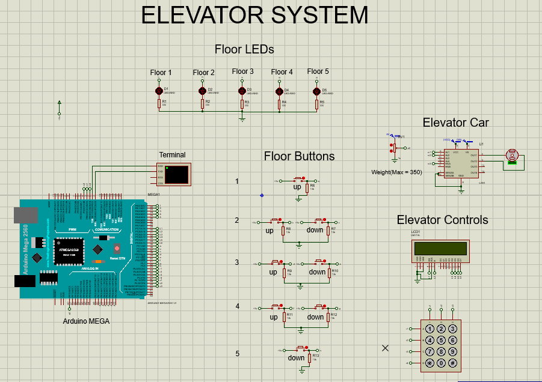

# 5-Story Elevator Control System

## Overview
A low-level embedded systems project utilizing an ATmega2560 microcontroller to manage a 5-story elevator system. To ensure high-efficiency execution, standard blocking functions (`delay()`) were completely avoided in favor of a non-blocking, multi-frequency execution architecture. The system features the classic SCAN scheduling algorithm designed to optimize pathing and a feed-forward load compensation loop for precise motor control.

Copyright 2026 Shanandha Aakash M S

## Hardware Architecture
* **Microcontroller:** ATmega2560 (Arduino Mega). Chosen to provide a massive GPIO footprint, enabling direct-wiring of all components. This eliminates the need for shift registers or multiplexers, dramatically minimizing system response time.
* **Sensors:** Potentiometer acting as an analog load cell, mapped via internal ADC to estimate passenger weight (0-300 kg).
* **Actuator:** DC Motor driven by an L298N H-Bridge with dynamic PWM.
* **Interface:** 4x3 Matrix Keypad (Internal), 8 Push-buttons (External), and a 16x2 LCD.
* **Schematic Optimization:** "Wireless" schematic design utilizing Proteus Terminal Labels to logically route connections. This eliminates wire clutter and creates an industry-standard, highly debuggable diagram.

## Software Architecture
The system operates on independent, non-blocking execution loops:
* **20Hz Input Polling Loop (50ms):** Samples the external hallway buttons and internal matrix keypad with a 300ms software debounce.
* **Continuous State Machine Loop:** Executes the SCAN (Elevator) Algorithm. Evaluates the `requestQueue` to sweep continuously in one direction until the path is clear, avoiding the peak motor surges caused by First-Come-First-Serve (FCFS) direction toggling.
* **3.3Hz Telemetry Loop (300ms):** Refreshes the 16x2 LCD with real-time floor, target, and state data.
* **Bare-Metal Diagnostics:** Executes direct `PORTA` register manipulation to output binary states to the 5 floor indicator LEDs simultaneously, drastically outperforming standard `digitalWrite()` library functions.

## Control Theory & Kinematics
Instead of basic ON/OFF motor toggling, the elevator's physical movement is mathematically modeled using a **trapezoidal velocity profile** ($a = 1.0 m/s^2$, $v_{max} = 1.0 m/s$, $d = 3.0 m$). The Finite State Machine transitions precisely through 1s Acceleration, 2s Cruising, and 1s Deceleration phases to prevent mechanical jerking.

Additionally, a **Feed-Forward Load Control** loop is implemented. The system reads the analog passenger weight and dynamically scales the baseline PWM duty cycle sent to the L298N driver. This ensures the DC motor maintains constant RPM and torque regardless of whether the cabin is empty or at its 300kg maximum capacity.

## Verification
This project was modeled and verified using Proteus 8 Professional.
1. Open the `.pdsprj` file in Proteus.
2. Compile the source code to generate the `.hex` payload and link it to the ATmega2560 component.
3. Adjust the passenger load potentiometer and trigger floor requests. The motor will smoothly execute the velocity profile while the LCD and PORTA-driven LEDs dynamically reflect the absolute system state.

### Simulation Results

